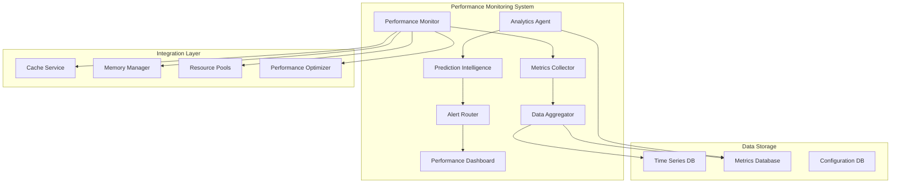

# Design Document - Phase 3C: Advanced Performance Monitoring & Analytics

## Overview

Phase 3C implements a comprehensive performance monitoring and analytics system that provides real-time monitoring, historical analysis, predictive insights, and automated recommendations. The system integrates seamlessly with existing performance optimization components (Phases 3A and 3B) to create a complete performance management solution.

## Architecture

### High-Level Architecture



### Component Architecture

The system follows a modular architecture with clear separation of concerns:

1. **Monitoring Layer**: Real-time data collection and processing
2. **Analytics Layer**: Historical analysis and pattern recognition
3. **Intelligence Layer**: Predictive modeling and recommendations
4. **Presentation Layer**: Dashboards, alerts, and user interfaces
5. **Integration Layer**: Connections to existing performance systems

## Components and Interfaces

### 1. Performance Monitor (`PerformanceMonitor`)

**Purpose**: Central coordinator for all performance monitoring activities.

**Key Methods**:
- `start_monitoring()`: Initialize monitoring services
- `stop_monitoring()`: Gracefully shutdown monitoring
- `get_current_status()`: Real-time system status
- `configure_monitoring(config)`: Update monitoring configuration

**Integration Points**:
- Coordinates with all existing performance services
- Manages monitoring lifecycle and configuration
- Provides unified interface for monitoring operations

### 2. Metrics Collector (`MetricsCollector`)

**Purpose**: Collect performance metrics from various system components.

**Key Methods**:
- `collect_system_metrics()`: Gather system-level metrics
- `collect_application_metrics()`: Gather application-specific metrics
- `collect_custom_metrics(source)`: Collect from custom sources
- `register_metric_source(source)`: Add new metric sources

**Metrics Collected**:
- **System Metrics**: CPU, memory, disk, network usage
- **Application Metrics**: Response times, throughput, error rates
- **Cache Metrics**: Hit rates, miss rates, eviction rates
- **Resource Metrics**: Pool utilization, allocation efficiency

### 3. Data Aggregator (`DataAggregator`)

**Purpose**: Process, aggregate, and store collected metrics data.

**Key Methods**:
- `aggregate_metrics(timeframe)`: Aggregate metrics over time periods
- `store_metrics(metrics)`: Persist metrics to storage
- `query_metrics(query)`: Retrieve historical metrics
- `cleanup_old_data()`: Remove expired data

**Aggregation Strategies**:
- **Real-time**: 5-second intervals for immediate monitoring
- **Short-term**: 1-minute averages for recent trends
- **Medium-term**: 5-minute averages for hourly analysis
- **Long-term**: 1-hour averages for daily/weekly trends

### 4. Analytics Agent (`AnalyticsAgent`)

**Purpose**: Analyze historical data to identify patterns and trends.

**Key Methods**:
- `analyze_trends(timeframe)`: Identify performance trends
- `detect_anomalies()`: Find unusual performance patterns
- `generate_insights()`: Create actionable insights
- `compare_periods(period1, period2)`: Compare performance across time

**Analysis Capabilities**:
- **Trend Analysis**: Identify upward/downward performance trends
- **Anomaly Detection**: Statistical outlier detection
- **Pattern Recognition**: Recurring performance patterns
- **Correlation Analysis**: Relationships between different metrics

### 5. Prediction Intelligence (`PredictionIntelligence`)

**Purpose**: Provide predictive insights about future performance.

**Key Methods**:
- `predict_performance(horizon)`: Forecast future performance
- `predict_capacity_needs()`: Predict resource requirements
- `identify_risk_factors()`: Highlight potential issues
- `generate_recommendations()`: Create optimization suggestions

**Prediction Models**:
- **Linear Regression**: For stable, trending metrics
- **Seasonal Decomposition**: For cyclical patterns
- **Moving Averages**: For short-term predictions
- **Threshold Models**: For capacity planning

### 6. Alert Router (`AlertRouter`)

**Purpose**: Manage alerts, notifications, and automated responses.

**Key Methods**:
- `configure_alerts(rules)`: Set up alerting rules
- `send_alert(alert)`: Dispatch alerts to configured channels
- `manage_alert_lifecycle()`: Handle alert states and resolution
- `aggregate_alerts()`: Combine related alerts

**Alert Types**:
- **Threshold Alerts**: When metrics exceed configured limits
- **Trend Alerts**: When performance trends indicate issues
- **Anomaly Alerts**: When unusual patterns are detected
- **Prediction Alerts**: When future issues are forecasted

### 7. Performance Dashboard (`PerformanceDashboard`)

**Purpose**: Provide visual interface for monitoring and analytics.

**Key Methods**:
- `render_dashboard()`: Generate dashboard HTML/data
- `get_widget_data(widget_id)`: Retrieve specific widget data
- `export_report(format)`: Export performance reports
- `customize_dashboard(config)`: Personalize dashboard layout

**Dashboard Components**:
- **Real-time Status**: Current system health and performance
- **Trend Charts**: Historical performance visualizations
- **Alert Panel**: Active alerts and notifications
- **Recommendation Cards**: Automated optimization suggestions

## Data Models

### Performance Metric

```python
@dataclass
class PerformanceMetric:
    timestamp: datetime
    metric_name: str
    metric_value: float
    metric_unit: str
    source_component: str
    tags: Dict[str, str]
    metadata: Dict[str, Any]
```

### Performance Alert

```python
@dataclass
class PerformanceAlert:
    alert_id: str
    alert_type: AlertType
    severity: AlertSeverity
    title: str
    description: str
    triggered_at: datetime
    resolved_at: Optional[datetime]
    metric_name: str
    threshold_value: float
    actual_value: float
    recommendations: List[str]
```

### Analytics Insight

```python
@dataclass
class AnalyticsInsight:
    insight_id: str
    insight_type: InsightType
    title: str
    description: str
    confidence_score: float
    impact_assessment: str
    recommendations: List[str]
    supporting_data: Dict[str, Any]
    generated_at: datetime
```

## Error Handling

### Monitoring Resilience

1. **Graceful Degradation**: Continue core functionality if monitoring fails
2. **Circuit Breaker**: Prevent cascading failures in monitoring components
3. **Fallback Mechanisms**: Use cached data when real-time collection fails
4. **Error Recovery**: Automatic retry and recovery for transient failures

### Data Integrity

1. **Validation**: Ensure metric data quality and consistency
2. **Deduplication**: Handle duplicate metrics from multiple sources
3. **Gap Handling**: Interpolate or flag missing data points
4. **Corruption Detection**: Identify and handle corrupted metrics

## Testing Strategy

### Unit Testing

- **Component Testing**: Individual monitoring components
- **Metric Collection**: Verify accurate data collection
- **Analytics Logic**: Test trend analysis and anomaly detection
- **Prediction Models**: Validate forecasting accuracy

### Integration Testing

- **End-to-End Monitoring**: Complete monitoring pipeline
- **Alert Workflows**: Alert generation and delivery
- **Dashboard Rendering**: UI component integration
- **Performance Impact**: Ensure monitoring doesn't degrade performance

### Performance Testing

- **Monitoring Overhead**: Measure monitoring system impact
- **Scalability**: Test with high metric volumes
- **Real-time Requirements**: Verify sub-second response times
- **Storage Efficiency**: Optimize data storage and retrieval

## Security Considerations

### Data Privacy

1. **Metric Sanitization**: Remove sensitive information from metrics
2. **Access Control**: Role-based access to monitoring data
3. **Data Encryption**: Encrypt stored performance data
4. **Audit Logging**: Track access to monitoring information

### System Security

1. **Input Validation**: Validate all metric inputs
2. **Rate Limiting**: Prevent monitoring system abuse
3. **Secure Communications**: Encrypt monitoring data transmission
4. **Privilege Separation**: Run monitoring with minimal privileges

## Performance Requirements

### Real-time Monitoring

- **Collection Latency**: < 100ms for metric collection
- **Processing Latency**: < 500ms for real-time aggregation
- **Dashboard Response**: < 2 seconds for dashboard rendering
- **Alert Delivery**: < 30 seconds for critical alerts

### Scalability

- **Metric Volume**: Support 10,000+ metrics per minute
- **Storage Growth**: Handle 1GB+ of metrics data per day
- **Concurrent Users**: Support 50+ simultaneous dashboard users
- **Historical Queries**: Sub-second response for 30-day queries

## Deployment Considerations

### Resource Requirements

- **CPU**: Moderate CPU usage for analytics processing
- **Memory**: 512MB-1GB for metric buffering and caching
- **Storage**: 10GB+ for historical data retention
- **Network**: Minimal bandwidth for metric collection

### Configuration Management

- **Monitoring Configuration**: YAML-based configuration files
- **Alert Rules**: Flexible rule definition system
- **Dashboard Customization**: User-specific dashboard layouts
- **Integration Settings**: Connection parameters for existing systems

## Future Enhancements

### Advanced Analytics

- **Machine Learning**: ML-based anomaly detection and prediction
- **Custom Metrics**: User-defined metric collection and analysis
- **Cross-System Correlation**: Correlate with external monitoring systems
- **Advanced Visualizations**: Interactive charts and drill-down capabilities

### Integration Expansion

- **External Monitoring**: Integration with Prometheus, Grafana, etc.
- **Cloud Monitoring**: AWS CloudWatch, Azure Monitor integration
- **Log Correlation**: Correlate performance metrics with application logs
- **Business Metrics**: Link performance to business KPIs